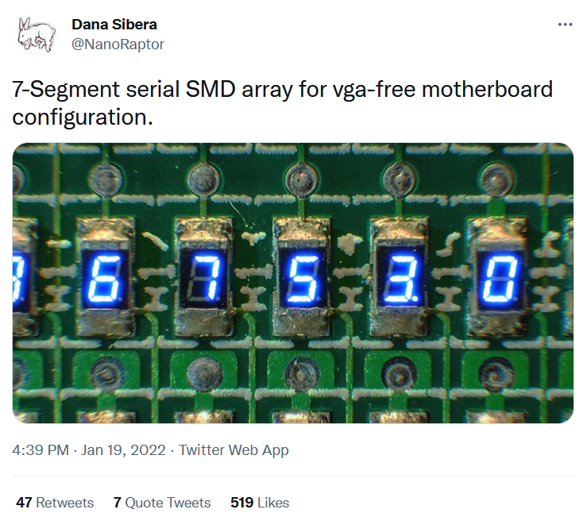

# The NanoRaptor NanoSegment

## Experiments in miniature 7-segment displays

### Sam Ettinger, November 2022

Like many good projects, this started with [a prank tweet:](https://twitter.com/NanoRaptor/status/1483962337334022145)

Like many others, I immediately got sucked into hypotheticals, wondering what it would take to make one of these IRL. Some 0201-sized LEDs in a 7-segment arrangement could fit in an 0805-ish footprint, right?

There are three KiCad projects in the `kicad/` folder:
    - `6pin_7seg_0806`, the first version. It's just a panelized PCB with no schematic and some, shall we say, unique features (TODO: explain)
    - `6pin_7seg_0806_display_board`. Once the 6-pin 0806 modules are assembled, the modules can be soldered to this board and controlled with an ATtiny84. There are some unused 0805 footprints nearby the modules, which I thought would contribute to it looking like a "real" component.
    - `nanoraptor_nanosegment`, my current idea. I want to see if I can fold up an OSH Park flex PCB into a 1208-size footprint with just two pins.

TODO: finish this